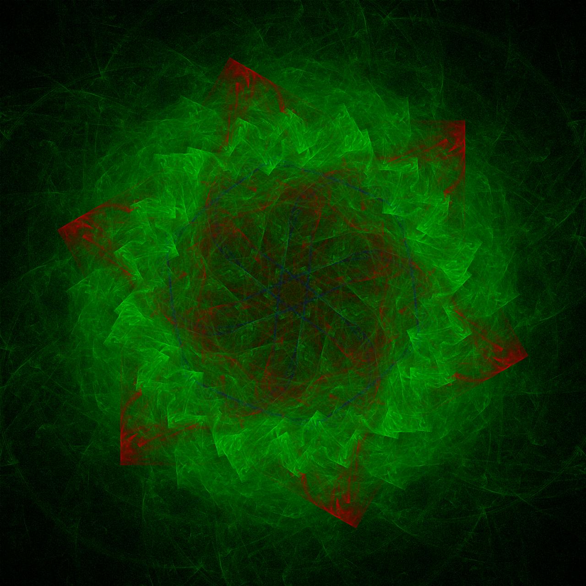
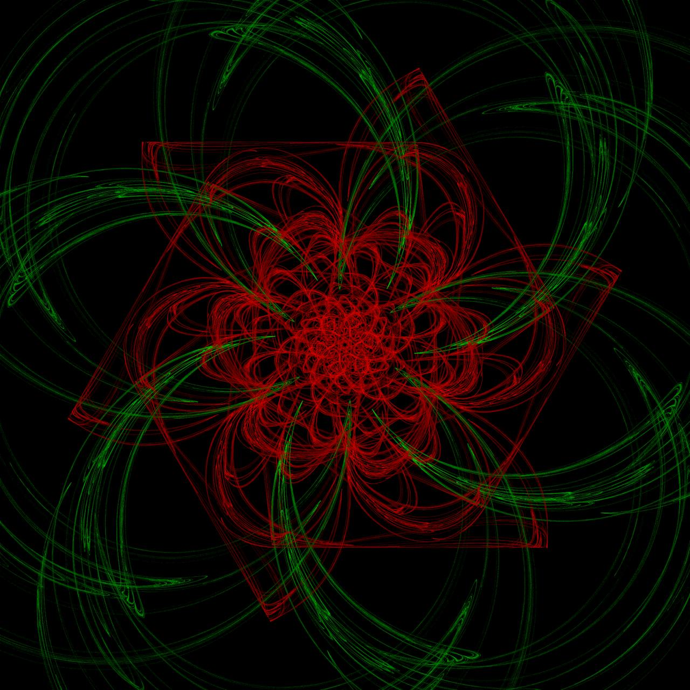
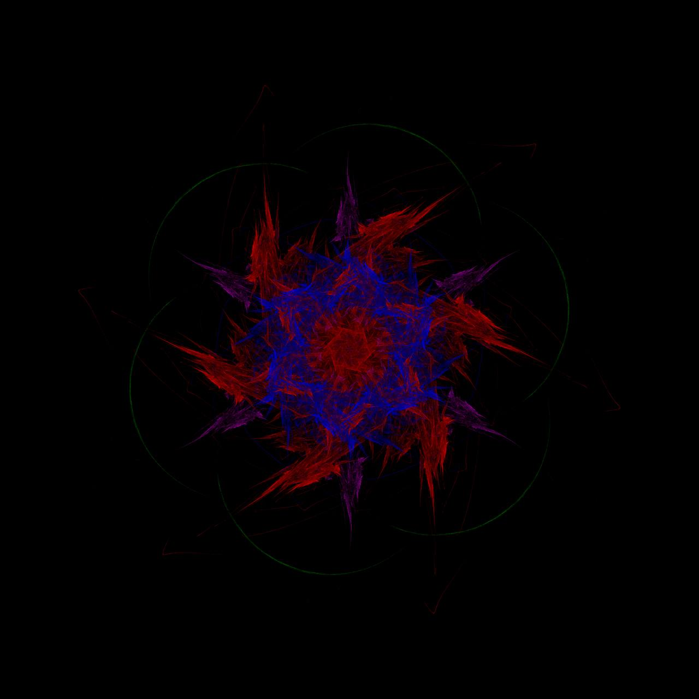

# Fractal Flame Project

Данный проект реализует алгоритм генерации фрактального пламени на основе идеи Chaos Game.

## Описание

Программа может быть запущена как в однопоточном, так и в многопоточном режиме, поддерживает конфигурацию параметров (размер изображения, количество итераций, набор трансформаций и т.д.) и позволяет получить красочное изображение фрактального пламени.

## Возможности

- Генерация фрактального пламени с использованием множества трансформаций.
- Настройка размеров изображения, количества итераций, масштабов и смещений.
- Выбор симметрии (радиальная, вертикальная, горизонтальная).
- Режимы запуска: однопоточный и многопоточный.
- Логарифмическая нормализация плотности и гамма-коррекция изображения.
- Сохранение результата в файл формата PNG.

## Пример запуска

При запуске программа запросит параметры изображения, количество итераций, тип симметрии и другие настройки, а затем сгенерирует фрактальное пламя и сохранит итоговое изображение.

## Был выполнен нагрузочный тест

При запуске в однопоточном и многопоточном режиме результаты примерно такие
### Single-thread duration (ns): 429241417
### Multi-thread duration (ns): 237002959

## Примеры результатов

Ниже будут добавлены примеры изображений, полученных с разными параметрами:

**Пример 1:**

**Пример 2:**

**Пример 3:**

